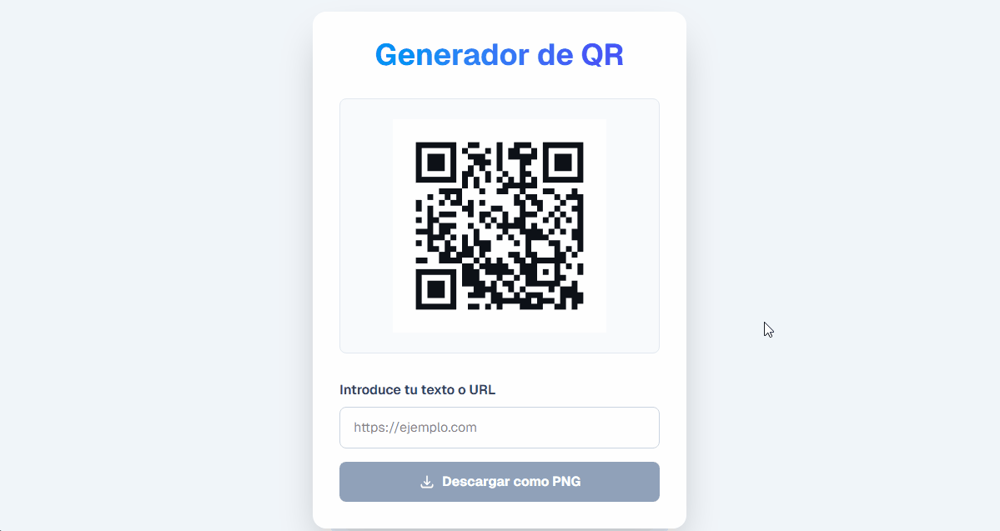

# Generador de Códigos QR 🚀



> Una herramienta web rápida y minimalista para generar códigos QR. Permite a los usuarios convertir cualquier URL o texto en un código QR funcional que puede ser descargado o escaneado directamente desde la pantalla.

**Ver el proyecto en vivo:** [**https://qrgenerator-app-dave.vercel.app/**](https://qrgenerator-app-dave.vercel.app/)

---

## ✨ Características Principales

* **⚡ Generación Instantánea:** El código QR se actualiza en tiempo real mientras el usuario escribe.
* **📥 Descarga de QR:** Permite descargar el código QR generado (probablemente como imagen PNG o SVG).
* **🖊️ Entrada Flexible:** Acepta tanto URLs completas como texto plano.
* **📱 Diseño Responsivo:** Interfaz limpia y fácil de usar en cualquier dispositivo.
* **🎨 Estilos Modernos:** Construido con Tailwind CSS para una apariencia pulida.

---

## 🛠️ Stack Tecnológico


---

## 🚀 Instalación y Uso Local

Para clonar y correr este proyecto en tu máquina local, sigue estos pasos:

1.  **Clona el repositorio:**
    ```bash
    git clone [https://github.com/TechDaveDev/qr-generator.git](https://github.com/TechDaveDev/qr-generator.git)
    cd qr-generator
    ```

2.  **Instala las dependencias:**
    ```bash
    npm install
    ```

3.  **Inicia el servidor de desarrollo:**
    ```bash
    npm run dev
    ```

Abre [http://localhost:3000](http://localhost:3000) en tu navegador para ver la aplicación.